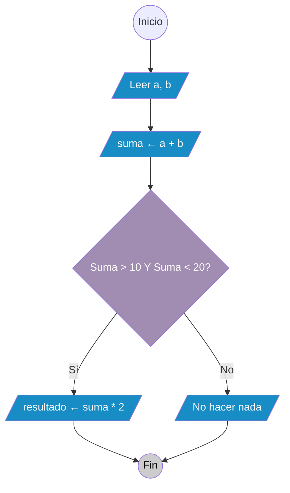
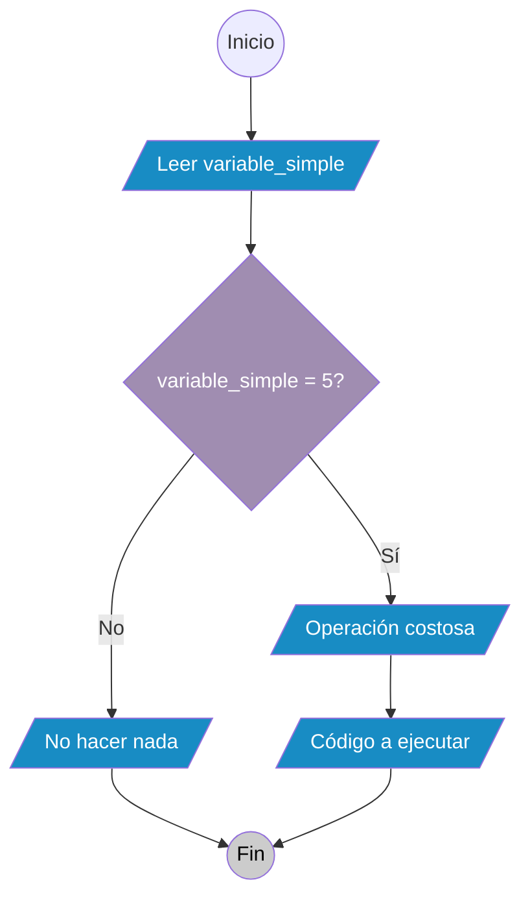
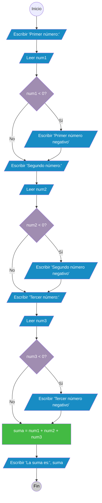
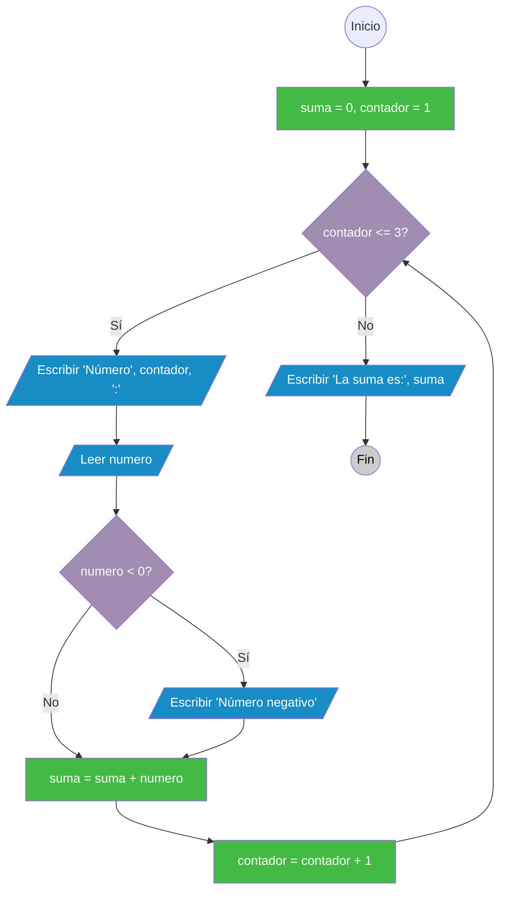

# 5. Casos de estudio y patrones comunes

En la programación, muchos problemas comparten patrones similares. Reconocer estos patrones nos ayuda a resolver problemas de manera más eficiente y a aplicar soluciones probadas. En esta sección exploraremos los patrones más comunes en el diseño de algoritmos.

## 5.1 Patrones fundamentales en algoritmos

### 5.1.1 Patrón de entrada-procesamiento-salida

Este es el patrón más básico y se encuentra en casi todos los algoritmos.

#### **Estructura general:**
1. **Entrada**: Obtener datos del usuario o del sistema
2. **Procesamiento**: Realizar cálculos o transformaciones
3. **Salida**: Mostrar o guardar los resultados

> ***Ejemplo: Calculadora de superficie***
>
>::: tabs
>== Pseudocódigo
>```plaintext
>INICIO
>  // ENTRADA
>  ESCRIBIR "Introduzca la base:"
>  LEER base
>  ESCRIBIR "Introduzca la altura:"
>  LEER altura
>  
>  // PROCESAMIENTO
>  superficie ← base * altura
>  
>  // SALIDA
>  ESCRIBIR "La superficie es: " + superficie
>FIN
>```
>== Diagrama de flujo
>```mermaid
>graph TD;
>    A((Inicio)) --> B[/Escribir "Introduzca la base:"/]:::romboide;
>    B --> C[/Leer base/]:::romboide;
>    C --> D[/Escribir "Introduzca la altura:"/]:::romboide;
>    D --> E[/Leer altura/]:::romboide;
>    E --> F[superficie = base * altura]:::rectangulo;
>    F --> G[/Escribir "La superficie es:", superficie/]:::romboide;
>    G --> H((Fin)):::inicio_fin;
>
>    classDef romboide fill:#188CC4, color:white;
>    classDef rombe fill:#A08DB1, color:white;
>    classDef rectangulo fill:#43BA43, color:white;
>    classDef inicio_fin fill:#ccc, color:#000;
>``` 
>:::

#### **Aplicaciones del patrón:**
- Calculadoras
- Convertidores de unidades
- Sistemas de puntuación
- Procesamiento de datos básico

### 5.1.2 Patrón de validación de entrada

Asegura que los datos introducidos por el usuario sean válidos antes de procesarlos.

#### **Estructura general:**
1. Pedir una entrada al usuario
2. Verificar si la entrada es válida
3. Si no es válida, mostrar un error y volver al paso 1
4. Si es válida, continuar con el procesamiento

> ***Ejemplo: Validar edad***
>
>::: tabs
>== Pseudocódigo
>```plaintext
>INICIO
>    Repetir
>        Escribir "Introduzca su edad (0-120):"
>        Leer edad
>        Si edad < 0 O edad > 120 Entonces
>            Escribir "Error: La edad debe estar entre 0 y 120"
>        Fin_Si
>    Mientras edad < 0 O edad > 120
>    
>    Escribir "Edad válida:", edad
>FIN
>```
>== Diagrama de flujo
>```mermaid
>graph TD;
>    A((Inicio)) --> B[/Escribir 'Introduzca edad 0-120'/]:::romboide;
>    B --> C[/Leer edad/]:::romboide;
>    C --> D{edad < 0 O edad > 120?}:::rombe;
>    D -->|Sí| E[/Escribir 'Error: edad entre 0 y 120'/]:::romboide;
>    D -->|No| F{edad < 0 O edad > 120?}:::rombe;
>    E --> F;
>    F -->|Sí| B;
>    F -->|No| G[/Escribir 'Edad válida:', edad/]:::romboide;
>    G --> H((Fin)):::inicio_fin;
>
>    classDef romboide fill:#188CC4, color:white;
>    classDef rombe fill:#A08DB1, color:white;
>    classDef rectangulo fill:#43BA43, color:white;
>    classDef inicio_fin fill:#ccc, color:#000;
>```

### 5.1.3 Patrón de búsqueda

Buscar un elemento específico dentro de un conjunto de datos.

#### **Búsqueda secuencial:**
Se busca elemento por elemento hasta encontrarlo o agotar la lista.

Estructura general:
1. Inicializar una variable para controlar si se ha encontrado el elemento
2. Iterar sobre cada elemento de la lista
3. Si el elemento coincide con el buscado, marcarlo como encontrado
4. Si se ha encontrado, mostrar la posición; si no, indicar que no se ha encontrado

> ***Ejemplo: Búsqueda de un elemento en una lista***
>::: tabs
>== Pseudocódigo
>```plaintext
>INICIO
>  encontrado ← FALSO
>  posición ← 0
>  MIENTRAS posición < tamaño_lista Y NO encontrado
>    SI elemento de la lista en posición = elemento_buscado ENTONCES
>      encontrado ← VERDADERO
>    SINO
>      posición ← posición + 1
>    FIN SI
>  FIN MIENTRAS
>  
>  SI encontrado ENTONCES
>    ESCRIBIR "Elemento encontrado en la posición: " + posición
>  SINO
>    ESCRIBIR "Elemento no encontrado"
>  FIN SI
>FIN
>```
>== Diagrama de flujo
>```mermaid
>graph TD;
>    A((Inicio)) --> B[/Inicializar encontrado a FALSO, posición a 0/]:::romboide;
>    B --> C{posición < tamaño_lista Y NO encontrado?}
>    C -->|Sí| D[/Si elemento de la lista en posición = elemento_buscado/]:::rombe;
>    D -->|Sí| E[/encontrado ← VERDADERO/]:::romboide;
>    D -->|No| F[/posición ← posición + 1/]:::romboide;
>    C -->|No| G{¿encontrado?}:::rombe;
>    E --> G;
>    F --> C;
>    G -->|Sí| H[/Escribir 'Elemento encontrado en la posición:', posición/]:::romboide;
>    G -->|No| I[/Escribir 'Elemento no encontrado'/]
>    H --> J((Fin)):::inicio_fin;
>    I --> J;
>    J --> K((Fin)):::inicio_fin;
>
>    classDef romboide fill:#188CC4, color:white;
>    classDef rombe fill:#A08DB1, color:white;
>    classDef rectangulo fill:#43BA43, color:white;
>    classDef inicio_fin fill:#ccc, color:#000;
>```
>:::

### 5.1.4 Patrón de acumulación

Utilizado para calcular sumas, medias o ir acumulando valores.

Estructura general:
1. Inicializar una variable acumuladora a cero
2. Iterar sobre una lista de elementos
3. Para cada elemento, sumarlo al acumulador
4. Mostrar el resultado final

> ***Ejemplo: Calcular media de notas***
>
>::: tabs
>== Pseudocódigo
> ```plaintext
> INICIO
>   suma ← 0
>   contador ← 0
>   
>   REPETIR
>     ESCRIBIR "Introduzca una nota (o -1 para terminar):"
>     LEER nota
>     SI nota != -1 ENTONCES
>       suma ← suma + nota
>       contador ← contador + 1
>     FIN SI
>   MIENTRAS nota != -1
>   
>   SI contador > 0 ENTONCES
>     media ← suma / contador
>     ESCRIBIR "La media es: " + media
>   SINO
>     ESCRIBIR "No se han introducido notas"
>   FIN SI
> FIN
> ```
>== Diagrama de flujo
>```mermaid
>graph TD;
>    A((Inicio)) --> B[/Inicializar suma a 0, contador a 0/]:::romboide;
>    B --> C[/Escribir 'Introduzca una nota o -1 para terminar:'/]:::romboide;
>    C --> D[/Leer nota/]:::romboide;
>    D --> E{nota != -1?}:::rombe;
>    E -->|Sí| F[/suma ← suma + nota/]:::romboide;
>    F --> G[/contador ← contador + 1/]:::romboide;
>    G --> C;
>    E -->|No| H{contador > 0?}:::rombe;
>    H -->|Sí| I[/media ← suma / contador/]:::romboide;
>    I --> J[/Escribir 'La media es:', media/]:::romboide;
>    H -->|No| K[/Escribir 'No se han introducido notas'/]:::romboide;
>    J --> L((Fin)):::inicio_fin;
>    K --> L;
>    L --> M((Fin)):::inicio_fin;
>
>    classDef romboide fill:#188CC4, color:white;
>    classDef rombe fill:#A08DB1, color:white;
>    classDef rectangulo fill:#43BA43, color:white;
>    classDef inicio_fin fill:#ccc, color:#000;
>```
>:::

## 5.2 Optimización de patrones comunes

### 5.2.1 Principios de optimización

#### **Evitar cálculos redundantes**

::: tabs
== Pseudocódigo
```plaintext
// Malo: Calcular el mismo valor múltiples veces
SI (a + b) > 10 Y (a + b) < 20 ENTONCES
  resultado ← (a + b) * 2
FIN SI

// Bueno: Calcular una vez y reutilizar
suma ← a + b
SI suma > 10 Y suma < 20 ENTONCES
  resultado ← suma * 2
FIN SI
```
== Diagrama de flujo

:::

#### **Usar condiciones eficientes**
::: tabs
== Pseudocódigo
```plaintext
// Malo: Comprobar condiciones costosas primero
SI operacion_costosa() Y variable_simple = 5 ENTONCES
  // código
FIN SI

// Bueno: Comprobar condiciones simples primero
SI variable_simple = 5 Y operacion_costosa() ENTONCES
  // código
FIN SI
```
== Diagrama de flujo

:::

### 5.2.2 Refactorización de patrones

#### **Antes de refactorizar:**
::: tabs
== Pseudocódigo
```plaintext
INICIO
  ESCRIBIR "Introduzca el primer número:"
  LEER num1
  SI num1 < 0 ENTONCES
    ESCRIBIR "El primer número es negativo"
  FIN SI
  
  ESCRIBIR "Introduzca el segundo número:"
  LEER num2
  SI num2 < 0 ENTONCES
    ESCRIBIR "El segundo número es negativo"
  FIN SI
  
  ESCRIBIR "Introduzca el tercer número:"
  LEER num3
  SI num3 < 0 ENTONCES
    ESCRIBIR "El tercer número es negativo"
  FIN SI
  
  suma = num1 + num2 + num3
  ESCRIBIR "La suma es:", suma
FIN
```
== Diagrama de flujo

:::

#### **Después de refactorizar:**
::: tabs
== Pseudocódigo
```plaintext
INICIO
  suma = 0
  contador = 1
  
  Mientras contador <= 3 Hacer
    Escribir "Introduzca el número", contador, ":"
    Leer numero
    
    Si numero < 0 Entonces
      Escribir "El número", contador, "es negativo"
    Fin_Si
    
    suma = suma + numero
    contador = contador + 1
  Fin_Mientras
  
  Escribir "La suma es:", suma
FIN
```
== Diagrama de flujo

:::

::: tip Conceptos clave para recordar
- Los **patrones comunes** aparecen repetidamente en diferentes problemas
- Reconocer patrones **ahorra tiempo** y reduce errores
- La **validación de entrada** es crucial en aplicaciones reales
- Los **casos de estudio** nos ayudan a entender aplicaciones prácticas
- La **refactorización** mejora la calidad y mantenibilidad del código
- Cada sector tiene sus **patrones específicos** pero los fundamentales son universales
- La **optimización** es importante pero no debe comprometer la claridad del código
:::