# Ejemplos de algoritmos

## 3-Instrucciones básicas

### Ejemplo 3-1

**Enunciado**: Determinar la hipotenusa de un triángulo rectángulo conocidas las longitudes de sus dos catetos.

::: tabs
== Pseudocódigo

```
Inicio
    Inicializar CatA = 0, CatB = 0
    Leer CatA, CatB
    Calcular Hip = sqrt(CatA^2 + CatB^2)
    Escribir Hipotenusa
Fin
```

== Diagrama de flujo

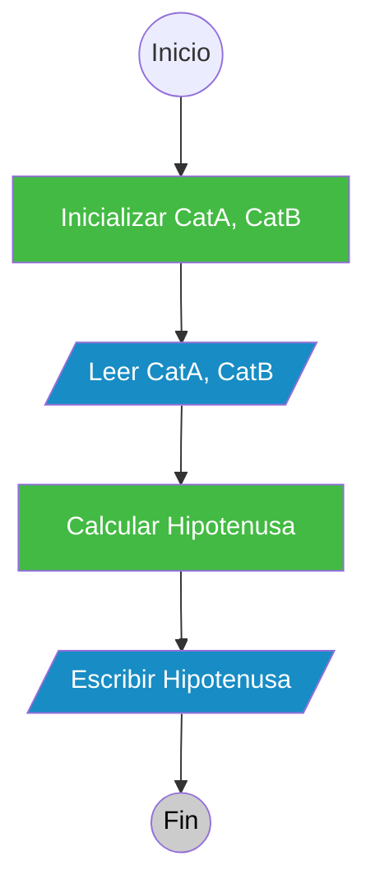
```mermaid

 graph TD;
    A((Inicio)) --> B[Inicializar CatA, CatB]:::rectangulo;
    B --> C[/Leer CatA, CatB/]:::romboide;
    C --> D[Calcular Hipotenusa]:::rectangulo;
    D --> E[/Escribir Hipotenusa/]:::romboide;
    E --> F((Fin)):::inicio_fin;

    classDef romboide fill:#188CC4, color:white;
    classDef rombe fill:#A08DB1, color:white;
    classDef rectangulo fill:#43BA43, color:white;
    classDef inicio_fin fill:#ccc, color:#000;
```

:::

### Ejemplo 3-2

**Enunciado**: Desarrolle un algoritmo que permita determinar el área y el volumen de un cilindro dado su radio (R) y altura (H).

::: tabs
== Pseudocódigo

```
Inicio
    Inicializar R = 0, H = 0
    Leer R, H
    Calcular Volumen = pi * R^2 * H
    Calcular Área = 2 * pi * R * (R + H)
    Escribir Área, Volumen
Fin
```

== Diagrama de flujo

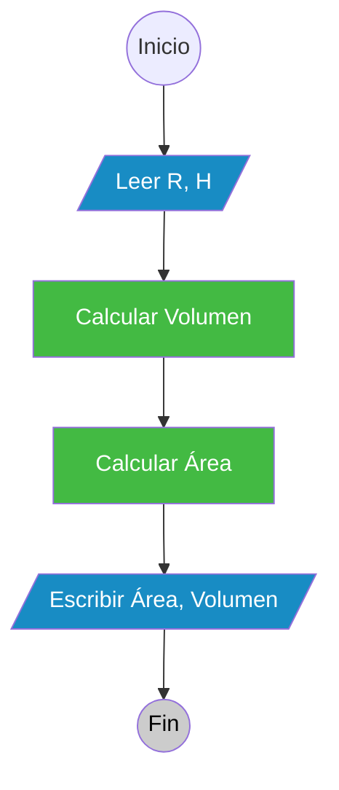
```mermaid
 graph TD;
    A((Inicio)) --> B[/Leer R, H/]:::romboide;
    B --> C[Calcular Volumen]:::rectangulo;
    C --> D[Calcular Área]:::rectangulo;
    D --> E[/Escribir Área, Volumen/]:::romboide;
    E --> F((Fin)):::inicio_fin;

    classDef romboide fill:#188CC4, color:white;
    classDef rombe fill:#A08DB1, color:white;
    classDef rectangulo fill:#43BA43, color:white;
    classDef inicio_fin fill:#ccc, color:#000;
```

:::

### Ejemplo 3-3

**Enunciado**: Realice un algoritmo que, a partir de proporcionarle la velocidad de un automóvil en kilómetros por hora, calcule la velocidad en metros por segundo.

::: tabs
== Pseudocódigo

```
Inicio
    Leer VelocidadKmH
    Calcular VelocidadMs = (VelocidadKmH * 1000) / 3600
    Escribir VelocidadMs
Fin
```

== Diagrama de flujo

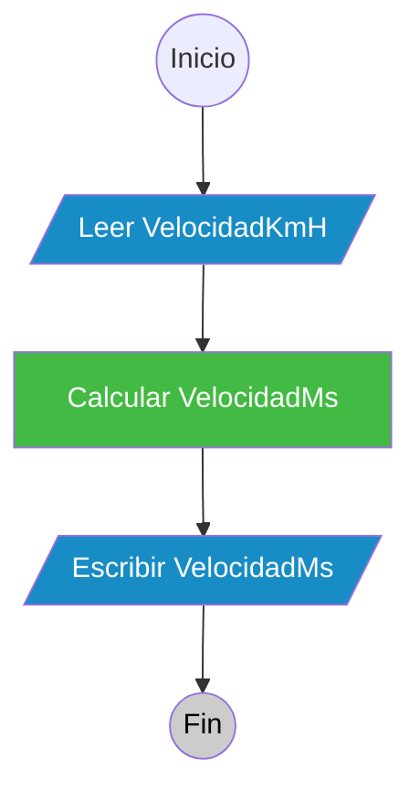
```mermaid
 graph TD;
    A((Inicio)) --> B[/Leer VelocidadKmH/]:::romboide;
    B --> C[Calcular VelocidadMs]:::rectangulo;
    C --> D[/Escribir VelocidadMs/]:::romboide;
    D --> E((Fin)):::inicio_fin;

    classDef romboide fill:#188CC4, color:white;
    classDef rombe fill:#A08DB1, color:white;
    classDef rectangulo fill:#43BA43, color:white;
    classDef inicio_fin fill:#ccc, color:#000;
```

:::

## 4-1 Estructura Alternativa Simple

### Ejemplo 4-1-1

**Enunciado**: Desarrolle un algoritmo que permita determinar si un estudiante ha aprobado en función de la nota introducida. Si la nota es superior o igual a 5, el sistema deberá indicar que el estudiante ha aprobado.

::: tabs
== Pseudocódigo

```
Inicio
  Leer nota
  Si nota >= 5 Entonces
    Escribir "Aprobado"
  Fin_Si
Fin
```

== Diagrama de flujo

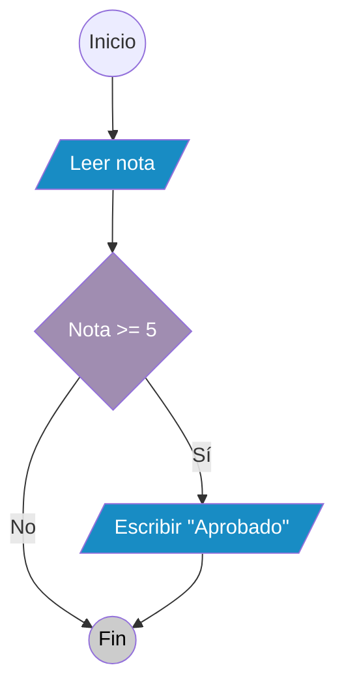
```mermaid
graph TD;
    A((Inicio)) --> B[/Leer nota/]:::romboide;
    B --> C{Nota >= 5}:::rombe;
    C -->|Sí| D[/Escribir "Aprobado"/]:::romboide;
    C -->|No| E((Fin)):::inicio_fin;
    D --> E;

    classDef romboide fill:#188CC4, color:white;
    classDef rombe fill:#A08DB1, color:white;
    classDef inicio_fin fill:#ccc, color:#000;
```

:::

### Ejemplo 4-1-2

**Enunciado**: Desarrolle un algoritmo que permita determinar si una persona es mayor de edad en función de la edad introducida. Si la edad es superior o igual a 18, el sistema deberá indicar que la persona es mayor de edad.

::: tabs
== Pseudocódigo

```
Inicio
  Leer edad
  Si edad >= 18 Entonces
    Escribir "Es mayor de edad"
  Fin_Si
Fin
```

== Diagrama de flujo

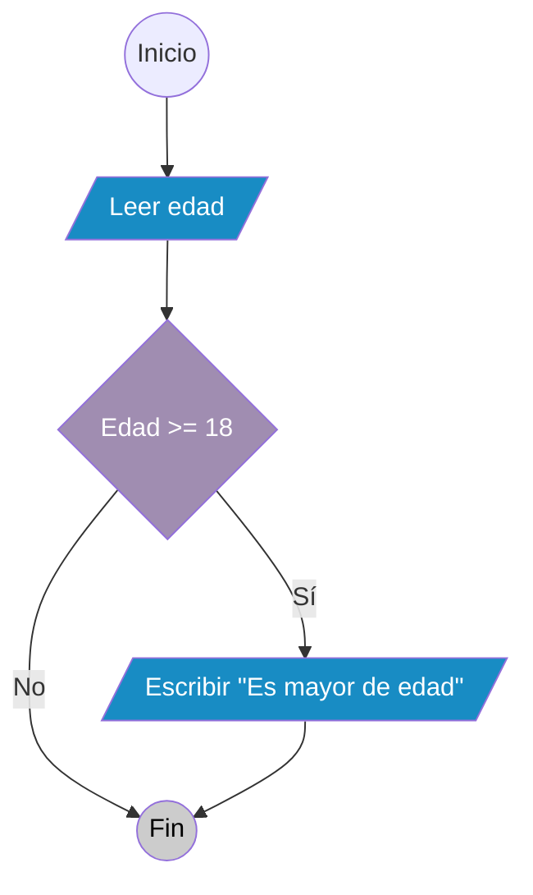
```mermaid
graph TD;
    A((Inicio)) --> B[/Leer edad/]:::romboide;
    B --> C{Edad >= 18}:::rombe;
    C -->|Sí| D[/Escribir "Es mayor de edad"/]:::romboide;
    C -->|No| E((Fin)):::inicio_fin;
    D --> E;

    classDef romboide fill:#188CC4, color:white;
    classDef rombe fill:#A08DB1, color:white;
    classDef inicio_fin fill:#ccc, color:#000;
```

:::

### Ejemplo 4-1-3

**Enunciado**: Desarrolle un algoritmo que permita leer dos números y ordenarlos de menor a mayor.

::: tabs
== Pseudocódigo

```
Inicio
    Leer A, B
    Si A > B Entonces
        Temporal = A
        A = B
        B = Temporal
    Fin_Si
    Escribir "Orden:", A, B
Fin
```

== Diagrama de flujo

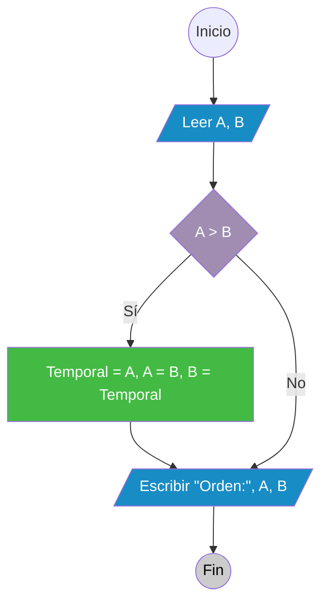
```mermaid
 graph TD;
    A((Inicio)) --> B[/Leer A, B/]:::romboide;
    B --> C{A > B}:::rombe;
    C -->|Sí| D[Temporal = A, A = B, B = Temporal]:::rectangulo;
    D --> E[/Escribir "Orden:", A, B/]:::romboide;
    C -->|No| E;
    E --> F((Fin)):::inicio_fin;

    classDef romboide fill:#188CC4, color:white;
    classDef rombe fill:#A08DB1, color:white;
    classDef rectangulo fill:#43BA43, color:white;
    classDef inicio_fin fill:#ccc, color:#000;
```

:::

## 4-2 Estructura Alternativa Doble

### Ejemplo 4-2-1

**Enunciado**: Desarrolle un algoritmo que permita determinar si una persona tiene fiebre en función de la temperatura introducida. Si la temperatura es superior a 37 grados, el sistema deberá indicar que la persona tiene fiebre; en caso contrario, indicará que la temperatura es normal.

::: tabs
== Pseudocódigo

```
Inicio
  Leer temperatura
  Si temperatura > 37 Entonces
    Escribir "Fiebre"
  Si no
    Escribir "Temperatura normal"
  Fin_Si
Fin
```

== Diagrama de flujo

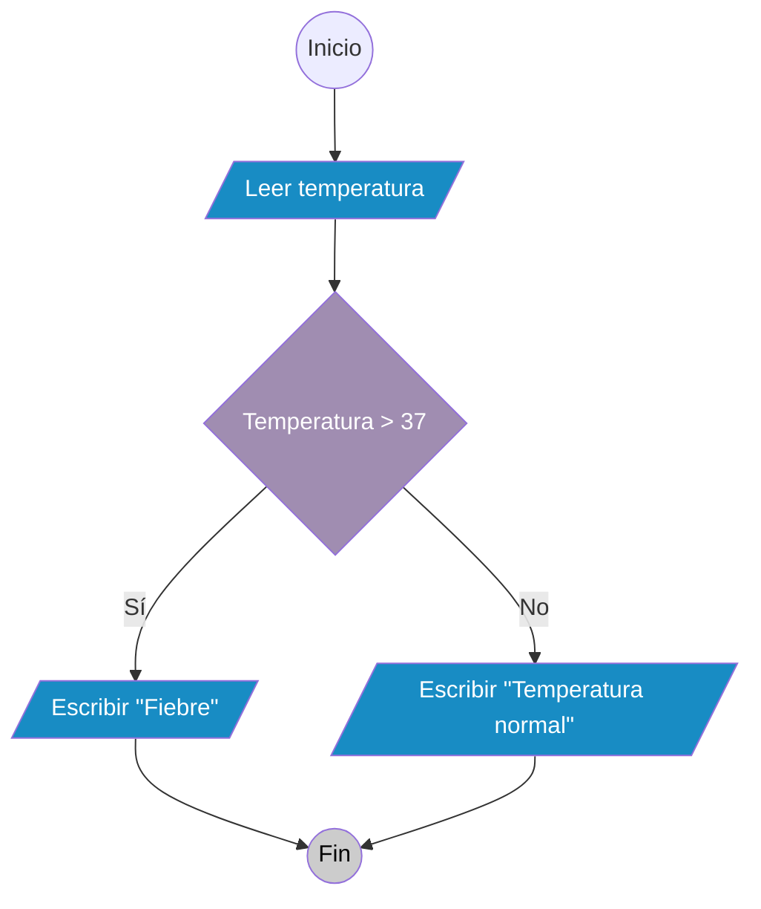
```mermaid
graph TD;
    A((Inicio)) --> B[/Leer temperatura/]:::romboide;
    B --> C{Temperatura > 37}:::rombe;
    C -->|Sí| D[/Escribir "Fiebre"/]:::romboide;
    C -->|No| E[/Escribir "Temperatura normal"/]:::romboide;
    D --> F((Fin)):::inicio_fin;
    E --> F;

    classDef romboide fill:#188CC4, color:white;
    classDef rombe fill:#A08DB1, color:white;
    classDef inicio_fin fill:#ccc, color:#000;
```

:::

### Ejemplo 4-2-2

**Enunciado**: Desarrolle un algoritmo que permita determinar si un valor es positivo o negativo. Si el valor introducido es igual o mayor que 0, el sistema indicará que es positivo; en caso contrario, indicará que es negativo.

::: tabs
== Pseudocódigo

```
Inicio
  Leer valor
  Si valor >= 0 Entonces
    Escribir "Es positivo"
  Si no
    Escribir "Es negativo"
  Fin_Si
Fin
```

== Diagrama de flujo

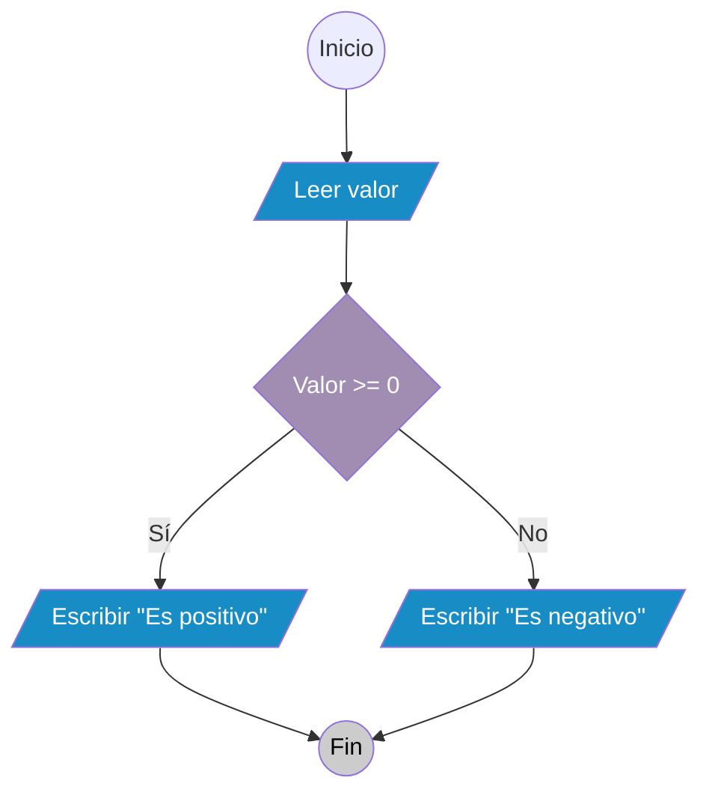
```mermaid
graph TD;
    A((Inicio)) --> B[/Leer valor/]:::romboide;
    B --> C{Valor >= 0}:::rombe;
    C -->|Sí| D[/Escribir "Es positivo"/]:::romboide;
    C -->|No| E[/Escribir "Es negativo"/]:::romboide;
    D --> F((Fin)):::inicio_fin;
    E --> F;

    classDef romboide fill:#188CC4, color:white;
    classDef rombe fill:#A08DB1, color:white;
    classDef inicio_fin fill:#ccc, color:#000;
```

:::

### Ejemplo 4-2-3

**Enunciado**: Desarrolle un algoritmo que permita leer dos valores diferentes, determinar cuál de los dos valores es el mayor y escribirlo.

::: tabs
== Pseudocódigo

```
Inicio
    Inicializar variables: A = 0, B = 0
    Solicitar dos valores diferentes
    Leer A, B
    Si A > B Entonces
        Escribir A, "es el mayor"
    Si no
        Escribir B, "es el mayor"
    Fin_Si
Fin
```

== Diagrama de flujo

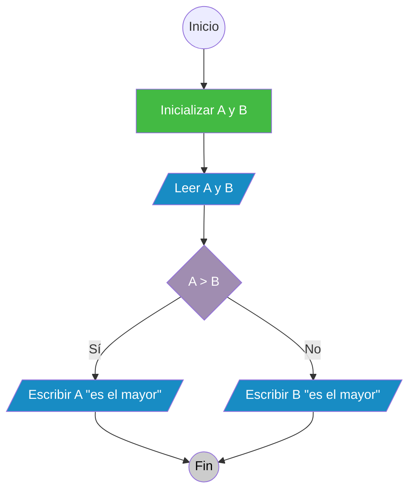
```mermaid
 graph TD;
    A((Inicio)) --> B[Inicializar A y B]:::rectangulo;
    B --> C[/Leer A y B/]:::romboide;
    C -->E{A > B}:::rombe;
    E -->|Sí| F[/Escribir A "es el mayor"/]:::romboide;
    E -->|No| G[/Escribir B "es el mayor"/]:::romboide;
    F --> H((Fin)):::inicio_fin;
    G --> H;
    
    classDef romboide fill:#188CC4, color:white;
    classDef rombe fill:#A08DB1, color:white;
    classDef rectangulo fill:#43BA43, color:white;
    classDef inicio_fin fill:#ccc, color:#000;
```

:::

### Ejemplo 4-2-4

**Enunciado**: Desarrolle un algoritmo que permita leer un valor cualquiera N y escribir si ese número es par o impar.

::: tabs
== Pseudocódigo

```
Inicio
    Leer N
    Si N % 2 = 0 Entonces
        Escribir "Es par"
    Si no
        Escribir "Es impar"
    Fin_Si
Fin
```

== Diagrama de flujo

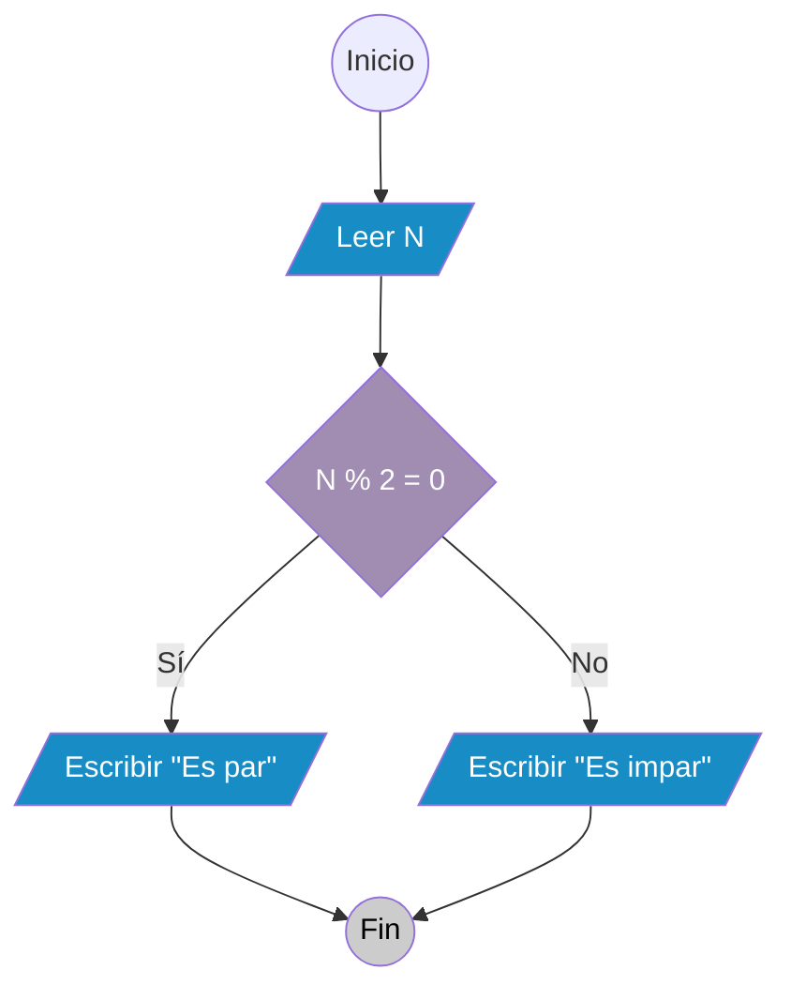
```mermaid
 graph TD;
    A((Inicio)) --> B[/Leer N/]:::romboide;
    B --> C{N % 2 = 0}:::rombe;
    C -->|Sí| D[/Escribir "Es par"/]:::romboide;
    C -->|No| E[/Escribir "Es impar"/]:::romboide;
    D --> F((Fin)):::inicio_fin;
    E --> F;

    classDef romboide fill:#188CC4, color:white;
    classDef rombe fill:#A08DB1, color:white;
    classDef rectangulo fill:#43BA43, color:white;
    classDef inicio_fin fill:#ccc, color:#000;
```

:::

## 4-3 Concatenación de sentencias condicionales

### Ejemplo 4-3-1

**Enunciado**: Desarrolle un algoritmo que permita clasificar una persona según su edad. Si la persona tiene menos de 12 años, se clasificará como "Infantil". Si tiene entre 12 y 18 años (ambos incluidos), se clasificará como "Adolescente". Si tiene más de 18 años, se clasificará como "Adulto".

::: tabs
== Pseudocódigo

```
Inicio
  Leer edad
  Si edad < 12 Entonces
    Escribir "Infantil"
  Si no Si edad <= 18 Entonces
    Escribir "Adolescente"
  Si no
    Escribir "Adulto"
  Fin_Si
Fin
```

== Diagrama de flujo


```mermaid
graph TD;
    A((Inicio)) --> B[/Leer edad/]:::romboide;
    B --> C{Edad < 12}:::rombe;
    C -->|Sí| D[/Escribir "Infantil"/]:::romboide;
    C -->|No| E{Edad <= 18}:::rombe;
    E -->|Sí| F[/Escribir "Adolescente"/]:::romboide;
    E -->|No| G[/Escribir "Adulto"/]:::romboide;
    D --> H((Fin)):::inicio_fin;
    F --> H;
    G --> H;

    classDef romboide fill:#188CC4, color:white;
    classDef rombe fill:#A08DB1, color:white;
    classDef inicio_fin fill:#ccc, color:#000;
```

:::

### Ejemplo 4-3-2

**Enunciado**: Desarrolle un algoritmo que permita clasificar una nota según su puntuación. Si la nota es 9 o superior, se considerará "Excelente". Si está entre 7 y 8, se clasificará como "Notable". Si está entre 5 y 6, será "Aprobado". Si es inferior a 5, será "Suspenso".

::: tabs
== Pseudocódigo

```
Inicio
  Leer nota
  Si nota >= 9 Entonces
    Escribir "Excelente"
  Si no Si nota >= 7 Entonces
    Escribir "Notable"
  Si no Si nota >= 5 Entonces
    Escribir "Aprobado"
  Si no
    Escribir "Suspenso"
  Fin_Si
Fin
```

== Diagrama de flujo

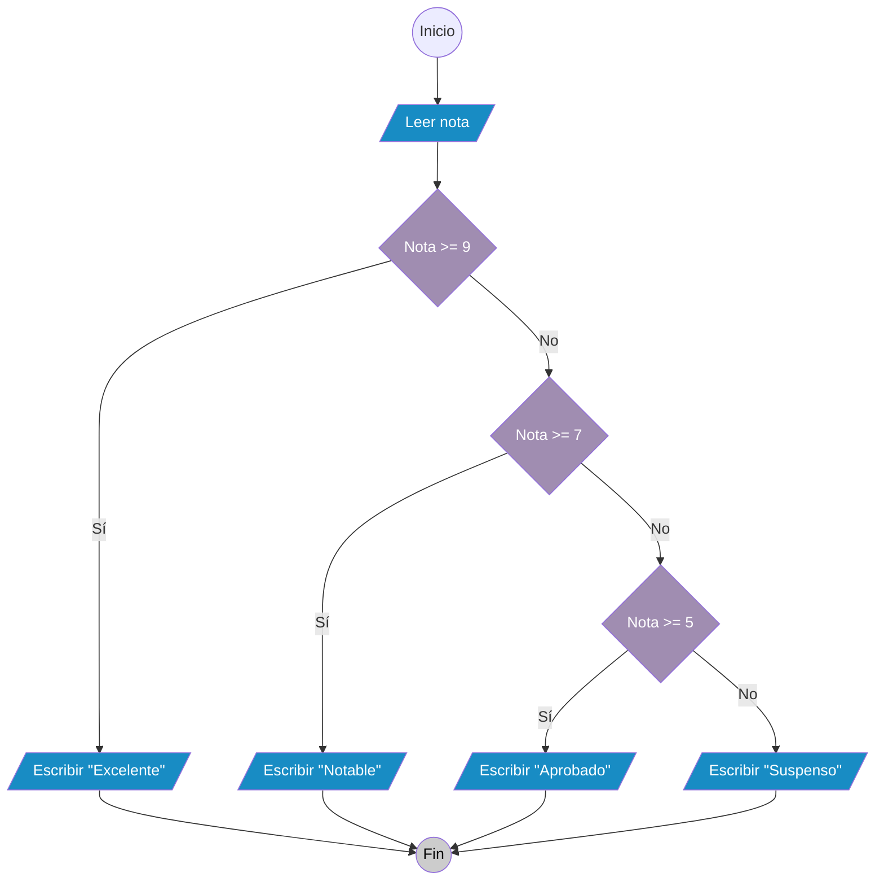
```mermaid
graph TD;
    A((Inicio)) --> B[/Leer nota/]:::romboide;
    B --> C{Nota >= 9}:::rombe;
    C -->|Sí| D[/Escribir "Excelente"/]:::romboide;
    C -->|No| E{Nota >= 7}:::rombe;
    E -->|Sí| F[/Escribir "Notable"/]:::romboide;
    E -->|No| G{Nota >= 5}:::rombe;
    G -->|Sí| H[/Escribir "Aprobado"/]:::romboide;
    G -->|No| I[/Escribir "Suspenso"/]:::romboide;
    D --> J((Fin)):::inicio_fin;
    F --> J;
    H --> J;
    I --> J;

    classDef romboide fill:#188CC4, color:white;
    classDef rombe fill:#A08DB1, color:white;
    classDef inicio_fin fill:#ccc, color:#000;
```

:::

### Ejemplo 4-3-3

**Enunciado**: Desarrolle un algoritmo que permita leer tres valores y almacenarlos en las variables A, B y C respectivamente. El algoritmo debe imprimir cuál es el mayor y cuál es el menor. Los tres valores deben ser diferentes.

::: tabs
== Pseudocódigo

```
Inicio
    Inicializar A, B, C
    Leer A, B, C
    Si A > B y A > C Entonces
        Escribir A, "es el mayor"
    Si no Si B > A y B > C Entonces
        Escribir B, "es el mayor"
    Si no
        Escribir C, "es el mayor"
    Fin_Si
Fin
```

== Diagrama de flujo

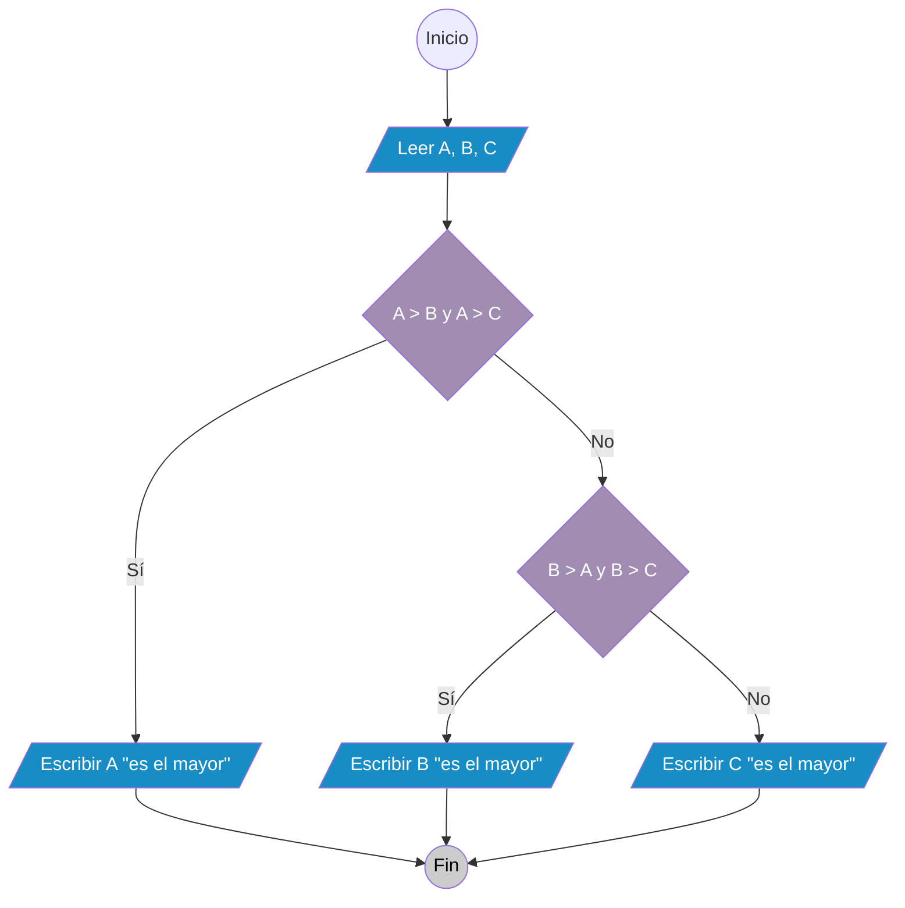
```mermaid
 graph TD;
    A((Inicio)) --> B[/Leer A, B, C/]:::romboide;
    B --> C{A > B y A > C}:::rombe;
    C -->|Sí| D[/Escribir A "es el mayor"/]:::romboide;
    C -->|No| E{B > A y B > C}:::rombe;
    E -->|Sí| F[/Escribir B "es el mayor"/]:::romboide;
    E -->|No| G[/Escribir C "es el mayor"/]:::romboide;
    D --> H((Fin)):::inicio_fin;
    F --> H;
    G --> H;

    classDef romboide fill:#188CC4, color:white;
    classDef rombe fill:#A08DB1, color:white;
    classDef rectangulo fill:#43BA43, color:white;
    classDef inicio_fin fill:#ccc, color:#000;
```

:::

### Ejemplo 4-3-4

**Enunciado**: Desarrolle un algoritmo que permita convertir calificaciones numéricas según la siguiente tabla: A = 19 y 20, B = 16, 17 y 18, C = 13, 14 y 15, D = 10, 11 y 12, E = 1 hasta el 9.

::: tabs
== Pseudocódigo

```
Inicio
    Leer Nota
    Si Nota >= 19 y Nota <= 20 Entonces
        Escribir "A"
    Si no Si Nota >= 16 y Nota <= 18 Entonces
        Escribir "B"
    Si no Si Nota >= 13 y Nota <= 15 Entonces
        Escribir "C"
    Si no Si Nota >= 10 y Nota <= 12 Entonces
        Escribir "D"
    Si no Si Nota >= 1 y Nota <= 9 Entonces
        Escribir "E"
    Fin_Si
Fin
```

== Diagrama de flujo

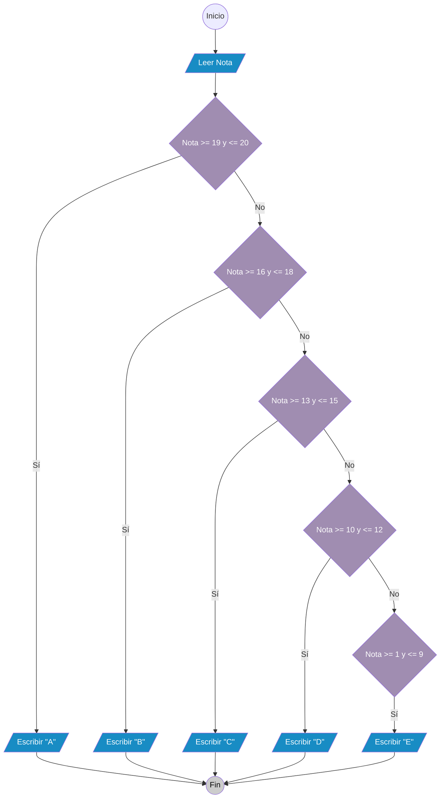
```mermaid
 graph TD;
    A((Inicio)) --> B[/Leer Nota/]:::romboide;
    B --> C{Nota >= 19 y <= 20}:::rombe;
    C -->|Sí| D[/Escribir "A"/]:::romboide;
    C -->|No| E{Nota >= 16 y <= 18}:::rombe;
    E -->|Sí| F[/Escribir "B"/]:::romboide;
    E -->|No| G{Nota >= 13 y <= 15}:::rombe;
    G -->|Sí| H[/Escribir "C"/]:::romboide;
    G -->|No| I{Nota >= 10 y <= 12}:::rombe;
    I -->|Sí| J[/Escribir "D"/]:::romboide;
    I -->|No| K{Nota >= 1 y <= 9}:::rombe;
    K -->|Sí| L[/Escribir "E"/]:::romboide;
    D --> M((Fin)):::inicio_fin;
    F --> M;
    H --> M;
    J --> M;
    L --> M;

    classDef romboide fill:#188CC4, color:white;
    classDef rombe fill:#A08DB1, color:white;
    classDef rectangulo fill:#43BA43, color:white;
    classDef inicio_fin fill:#ccc, color:#000;
```

:::

## 4-4 Estructura Alternativa Múltiple (Switch)

### Ejemplo 4-4-1

**Enunciado**: Desarrolle un algoritmo que, dado un número entre 1 y 7, escriba el nombre del día de la semana correspondiente. Si el valor no se encuentra entre 1 y 7, se debe mostrar "Día no válido".

::: tabs
== Pseudocódigo

```
Inicio
  Leer dia_semana
  Según (dia_semana)
    Caso 1: Escribir "Lunes"
    Caso 2: Escribir "Martes"
    Caso 3: Escribir "Miércoles"
    Caso 4: Escribir "Jueves"
    Caso 5: Escribir "Viernes"
    Caso 6: Escribir "Sábado"
    Caso 7: Escribir "Domingo"
    De lo contrario: Escribir "Día no válido"
  Fin_Según
Fin
```

== Diagrama de flujo

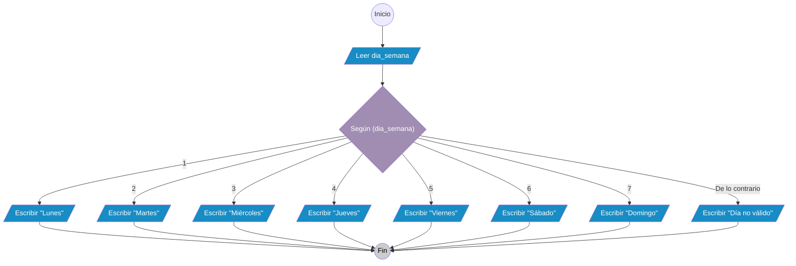
```mermaid
graph TD;
    A((Inicio)) --> B[/Leer dia_semana/]:::romboide;
    B --> C{"Según (dia_semana)"}:::rombe;
    C -->|1| D[/Escribir "Lunes"/]:::romboide;
    C -->|2| E[/Escribir "Martes"/]:::romboide;
    C -->|3| F[/Escribir "Miércoles"/]:::romboide;
    C -->|4| G[/Escribir "Jueves"/]:::romboide;
    C -->|5| H[/Escribir "Viernes"/]:::romboide;
    C -->|6| I[/Escribir "Sábado"/]:::romboide;
    C -->|7| J[/Escribir "Domingo"/]:::romboide;
    C -->|De lo contrario| K[/Escribir "Día no válido"/]:::romboide;
    D --> L((Fin)):::inicio_fin;
    E --> L;
    F --> L;
    G --> L;
    H --> L;
    I --> L;
    J --> L;
    K --> L;

    classDef romboide fill:#188CC4, color:white;
    classDef rombe fill:#A08DB1, color:white;
    classDef inicio_fin fill:#ccc, color:#000;
```

:::

### Ejemplo 4-4-2

**Enunciado**: Desarrolle un algoritmo que, dado un número entre 1 y 12 que representa un mes, escriba la estación del año correspondiente. Si el valor no se encuentra entre 1 y 12, se debe mostrar "Mes no válido".

::: tabs
== Pseudocódigo

```
Inicio
  Leer mes
  Según (mes)
    Caso 12, 1, 2: Escribir "Invierno"
    Caso 3, 4, 5: Escribir "Primavera"
    Caso 6, 7, 8: Escribir "Verano"
    Caso 9, 10, 11: Escribir "Otoño"
    De lo contrario: Escribir "Mes no válido"
  Fin_Según
Fin
```

== Diagrama de flujo

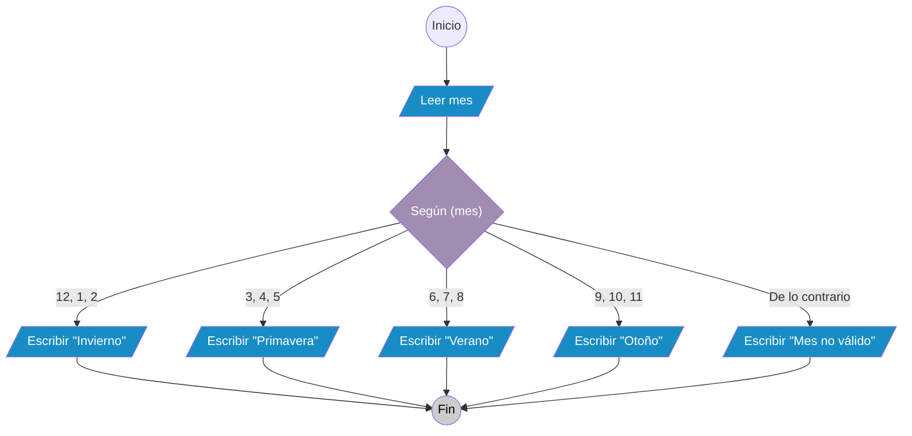
```mermaid
graph TD;
    A((Inicio)) --> B[/Leer mes/]:::romboide;
    B --> C{"Según (mes)"}:::rombe;
    C -->|12, 1, 2| D[/Escribir "Invierno"/]:::romboide;
    C -->|3, 4, 5| E[/Escribir "Primavera"/]:::romboide;
    C -->|6, 7, 8| F[/Escribir "Verano"/]:::romboide;
    C -->|9, 10, 11| G[/Escribir "Otoño"/]:::romboide;
    C -->|De lo contrario| H[/Escribir "Mes no válido"/]:::romboide;
    D --> I((Fin)):::inicio_fin;
    E --> I;
    F --> I;
    G --> I;
    H --> I;

    classDef romboide fill:#188CC4, color:white;
    classDef rombe fill:#A08DB1, color:white;
    classDef inicio_fin fill:#ccc, color:#000;
```

:::

## 4-5 Estructura Mientras (WHILE)

### Ejemplo 4-5-1

**Enunciado**: Desarrolle un algoritmo que muestre los números del 1 al 10. Utilice una estructura de bucle para incrementar un contador y mostrar su valor en cada iteración.

::: tabs
== Pseudocódigo

```
Inicio
  Inicializar N = 1
  Mientras N <= 10 Hacer
    Escribir N
    N = N + 1
  Fin_Mientras
Fin
```

== Diagrama de flujo

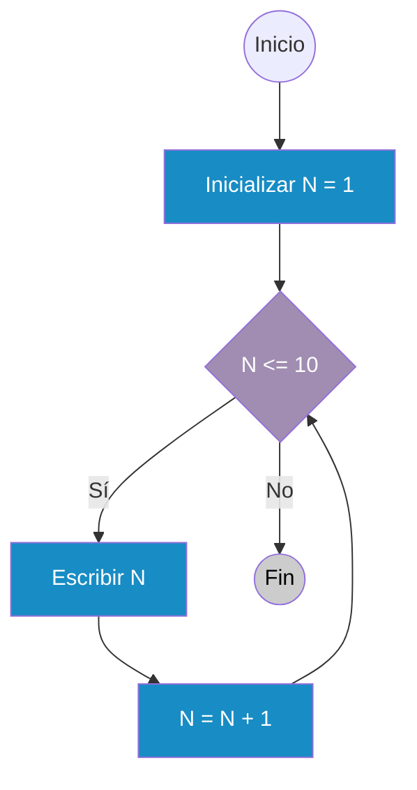
```mermaid
graph TD;
    A((Inicio)) --> B[Inicializar N = 1]:::romboide;
    B --> C{N <= 10}:::rombe;
    C -->|Sí| D[Escribir N]:::romboide;
    D --> E[N = N + 1]:::romboide;
    E --> C;
    C -->|No| F((Fin)):::inicio_fin;

    classDef romboide fill:#188CC4, color:white;
    classDef rombe fill:#A08DB1, color:white;
    classDef inicio_fin fill:#ccc, color:#000;
```

:::

### Ejemplo 4-5-2

**Enunciado**: Desarrolle un algoritmo que solicite una contraseña y muestre un mensaje de error hasta que se introduzca la contraseña correcta, que en este caso será "1234".

::: tabs
== Pseudocódigo

```
Inicio
  Leer contraseña
  Mientras contraseña != "1234" Hacer
    Escribir "Contraseña incorrecta"
    Leer contraseña
  Fin_Mientras
  Escribir "Contraseña correcta"
Fin
```

== Diagrama de flujo

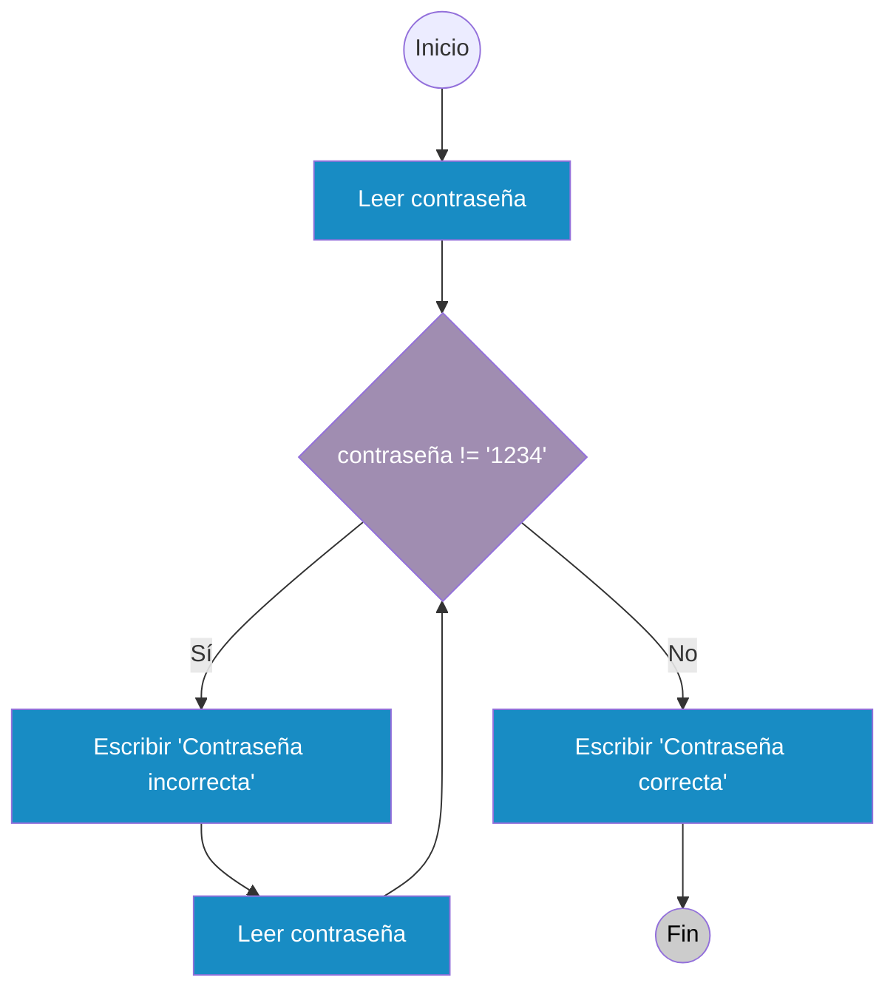
```mermaid
graph TD;
    A((Inicio)) --> B[Leer contraseña]:::romboide;
    B --> C{"contraseña != '1234'"}:::rombe;
    C -->|Sí| D[Escribir 'Contraseña incorrecta']:::romboide;
    D --> E[Leer contraseña]:::romboide;
    E --> C;
    C -->|No| F[Escribir 'Contraseña correcta']:::romboide;
    F --> G((Fin)):::inicio_fin;

    classDef romboide fill:#188CC4, color:white;
    classDef rombe fill:#A08DB1, color:white;
    classDef inicio_fin fill:#ccc, color:#000;
```

:::

### Ejemplo 4-5-3

**Enunciado**: Desarrolle un algoritmo que permita leer un valor entero positivo N y determinar si es primo o no.

::: tabs
== Pseudocódigo

```
Inicio
    Leer N
    Inicializar J = 2, S = 0
    Mientras J <= N / 2 Hacer
        Si N % J = 0 Entonces
            S = S + 1
        Fin_Si
        J = J + 1
    Fin_Mientras
    Si S = 0 Entonces
        Escribir N, "es primo"
    Si no
        Escribir N, "no es primo"
    Fin_Si
Fin
```

== Diagrama de flujo

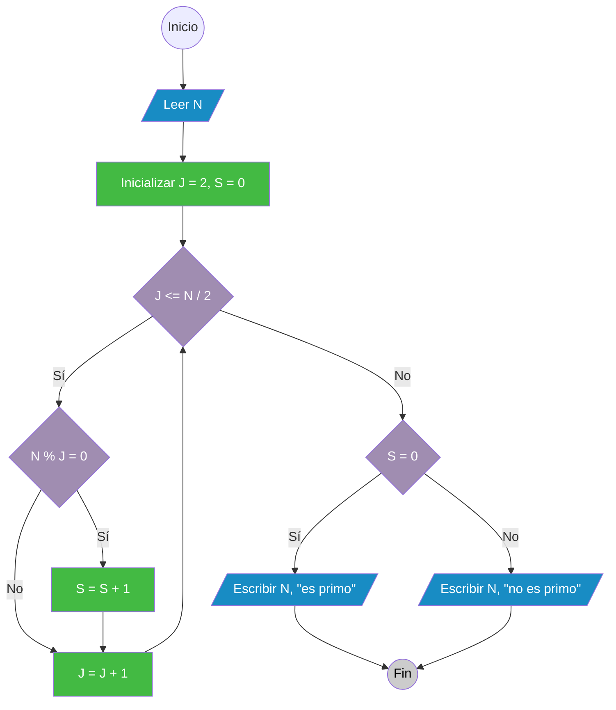
```mermaid
 graph TD;
    A((Inicio)) --> B[/Leer N/]:::romboide;
    B --> C[Inicializar J = 2, S = 0]:::rectangulo;
    C --> D{J <= N / 2}:::rombe;
    D -->|Sí| E{N % J = 0}:::rombe;
    E -->|Sí| F[S = S + 1]:::rectangulo;
    E -->|No| G[J = J + 1]:::rectangulo;
    F --> G;
    G --> D;
    D -->|No| H{S = 0}:::rombe;
    H -->|Sí| I[/Escribir N, "es primo"/]:::romboide;
    H -->|No| J[/Escribir N, "no es primo"/]:::romboide;
    I --> K((Fin)):::inicio_fin;
    J --> K;

    classDef romboide fill:#188CC4, color:white;
    classDef rombe fill:#A08DB1, color:white;
    classDef rectangulo fill:#43BA43, color:white;
    classDef inicio_fin fill:#ccc, color:#000;
```

:::

### Ejemplo 4-5-4

**Enunciado**: Desarrolle un algoritmo que permita convertir un número de días en años, meses, semanas y días.

::: tabs
== Pseudocódigo

```
Inicio
    Leer NumDias
    Inicializar Anios = 0, Meses = 0, Semanas = 0, Dias = 0
    Mientras NumDias >= 365 Hacer
        Anios = Anios + 1
        NumDias = NumDias - 365
    Fin_Mientras
    Mientras NumDias >= 30 Hacer
        Meses = Meses + 1
        NumDias = NumDias - 30
    Fin_Mientras
    Mientras NumDias >= 7 Hacer
        Semanas = Semanas + 1
        NumDias = NumDias - 7
    Fin_Mientras
    Dias = NumDias
    Escribir Anios, "años", Meses, "meses", Semanas, "semanas", Dias, "días"
Fin
```

== Diagrama de flujo

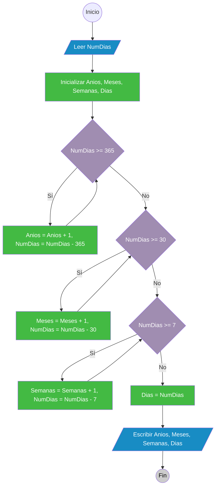
```mermaid
  graph TD;
    A((Inicio)) --> B[/Leer NumDias/]:::romboide;
    B --> C[Inicializar Anios, Meses, Semanas, Dias]:::rectangulo;
    C --> D{NumDias >= 365}:::rombe;
    D -->|Sí| E[Anios = Anios + 1, NumDias = NumDias - 365]:::rectangulo;
    E --> D;
    D -->|No| F{NumDias >= 30}:::rombe;
    F -->|Sí| G[Meses = Meses + 1, NumDias = NumDias - 30]:::rectangulo;
    G --> F;
    F -->|No| H{NumDias >= 7}:::rombe;
    H -->|Sí| I[Semanas = Semanas + 1, NumDias = NumDias - 7]:::rectangulo;
    I --> H;
    H -->|No| J[Dias = NumDias]:::rectangulo;
    J --> K[/Escribir Anios, Meses, Semanas, Dias/]:::romboide;
    K --> L((Fin)):::inicio_fin;

    classDef romboide fill:#188CC4, color:white;
    classDef rombe fill:#A08DB1, color:white;
    classDef rectangulo fill:#43BA43, color:white;
    classDef inicio_fin fill:#ccc, color:#000;
```

:::

## 4-6 Estructura Hasta que (DO-WHILE)

### Ejemplo 4-6-1

**Enunciado**: Desarrolle un algoritmo que solicite al usuario un número y lo escriba. Esto se repetirá hasta que el usuario introduzca un número igual a 0.

::: tabs
== Pseudocódigo

```
Inicio
  Hacer
    Leer número
    Escribir número
  Hasta que número = 0
Fin
```

== Diagrama de flujo

```mermaid
graph TD;
    A((Inicio)) --> B[Leer número]:::romboide;
    B --> C[Escribir número]:::romboide;
    C --> D{número = 0}:::rombe;
    D -->|No| B;
    D -->|Sí| E((Fin)):::inicio_fin;

    classDef romboide fill:#188CC4, color:white;
    classDef rombe fill:#A08DB1, color:white;
    classDef inicio_fin fill:#ccc, color:#000;
```

:::

### Ejemplo 4-6-2

**Enunciado**: Desarrolle un algoritmo que solicite al usuario un número mayor o igual a 18. Esto se repetirá hasta que el usuario escriba un número que cumpla la condición.

::: tabs
== Pseudocódigo

```
Inicio
  Hacer
    Leer edad
    Escribir edad
  Hasta que edad >= 18
Fin
```

== Diagrama de flujo

```mermaid
graph TD;
    A((Inicio)) --> B[Leer edad]:::romboide;
    B --> C[Escribir edad]:::romboide;
    C --> D{edad >= 18}:::rombe;
    D -->|No| B;
    D -->|Sí| E((Fin)):::inicio_fin;

    classDef romboide fill:#188CC4, color:white;
    classDef rombe fill:#A08DB1, color:white;
    classDef inicio_fin fill:#ccc, color:#000;
```

:::

## 4-7 Estructura Para (FOR)

### Ejemplo 4-7-1

**Enunciado**: Desarrolle un algoritmo que imprima los números del 1 al 10 utilizando un bucle para.

::: tabs
== Pseudocódigo

```Pseudocódigo
Inicio
  Para i = 1 hasta 10 Hacer
    Escribir i
  Fin_Para
Fin
```

== Diagrama de flujo

```mermaid
graph TD;
    A((Inicio)) --> B[Inicializar i = 1]:::romboide;
    B --> C{i <= 10}:::rombe;
    C -->|Sí| D[Escribir i]:::romboide;
    D --> E[Nueva iteración: i = i + 1]:::romboide;
    E --> B;
    C -->|No| F((Fin)):::inicio_fin;

    classDef romboide fill:#188CC4, color:white;
    classDef rombe fill:#A08DB1, color:white;
    classDef inicio_fin fill:#ccc, color:#000;
```

:::

### Ejemplo 4-7-2

**Enunciado**: Desarrolle un algoritmo que realice una cuenta atrás desde 30 hasta 1 antes del lanzamiento de un cohete. Al final, imprimir un mensaje de lanzamiento.

::: tabs
== Pseudocódigo

```Pseudocódigo
Inicio
  Para i = 30 hasta 1 paso -1 Hacer
    Escribir "T-minus " + i + " segundos"
  Fin_Para
  Escribir "¡Lanzamiento del cohete!"
Fin

```

== Diagrama de flujo

```mermaid
graph TD;
    A((Inicio)) --> B[Inicializar i = 10]:::romboide;
    B --> C{i >= 1}:::rombe;
    C -->|Sí| D[Escribir 'T-minus i segundos']:::romboide;
    D --> E[Nueva iteración: i = i - 1]:::romboide;
    E --> B;
    C -->|No| F[Escribir '¡Lanzamiento del cohete!']:::romboide;
    F --> G((Fin)):::inicio_fin;

    classDef romboide fill:#188CC4, color:white;
    classDef rombe fill:#A08DB1, color:white;
    classDef inicio_fin fill:#ccc, color:#000;
```

:::

### Ejemplo 4-7-3

**Enunciado**: Desarrolle un algoritmo que calcule el ahorro total al final del año, partiendo de un salario mensual fijo y aumentando el porcentaje de ahorro en un 1 % cada mes. El primer mes el ahorro es el 1 % del salario, el segundo mes el 2 %, y así sucesivamente hasta el duodécimo mes.

::: tabs
== Pseudocódigo

```
Inicio
    Leer salario_mensual
    Inicializar ahorro_total = 0
    Para mes = 1 hasta 12 Hacer
        ahorro_mes = salario_mensual * (mes / 100)  // Porcentaje que aumenta cada mes
        ahorro_total = ahorro_total + ahorro_mes
    Fin_Para
    Escribir "El ahorro total al final del año es:", ahorro_total
Fin
```

== Diagrama de flujo

```mermaid
graph TD;
    A((Inicio)) --> B[Leer salario_mensual]:::romboide;
    B --> C[Inicializar ahorro_total = 0]:::romboide;
    C --> D[Para mes = 1 hasta 12 Hacer]:::rombe;
    D --> E["ahorro_mes = salario_mensual * (mes / 100)"]:::romboide;
    E --> F[ahorro_total = ahorro_total + ahorro_mes]:::romboide;
    F --> D;
    D --> G[Escribir ahorro_total]:::romboide;
    G --> H((Fin)):::inicio_fin;

    classDef romboide fill:#188CC4, color:white;
    classDef rombe fill:#A08DB1, color:white;
    classDef inicio_fin fill:#ccc, color:#000;
```

:::

## 4-8 Elementos Auxiliares (Contadores, Acumuladores, Interruptores)

### Ejemplo con Contador

**Enunciado**: Enunciado: Desarrolle un algoritmo que permita a un jugador de blackjack contar las cartas. El jugador incrementará la cuenta en función de las cartas que reciba. Las cartas se valoran de la siguiente manera:

- Cartas 2 a 6: +1
- Cartas 7 a 9: 0
- Cartas 10, J, Q, K, A: -1

::: tabs
== Pseudocódigo

```
Inicio
  Inicializar cuenta = 0
  Hacer
    Leer carta
    Si carta = "Detener" Entonces
      Escribir "Cuenta final: " + cuenta
      Detener
    Fin_Si
    Si carta = "2" o carta = "3" o carta = "4" o carta = "5" o carta = "6" Entonces
      cuenta = cuenta + 1
    Si no Si carta = "10" o carta = "J" o carta = "Q" o carta = "K" o carta = "A" Entonces
      cuenta = cuenta - 1
    Fin_Si
    Escribir "Cuenta actual: " + cuenta
  Hasta que carta = "Detener"
Fin
```

== Diagrama de flujo

```mermaid
graph TD;
  A((Inicio)) --> B[Inicializar cuenta = 0]:::romboide;
  B --> C[Leer carta]:::romboide;
  C --> D{"carta = 'Detener'"}:::rombe;
  D -->|Sí| E["Escribir 'Cuenta final: ' + cuenta"]:::romboide;
  E --> F((Fin)):::inicio_fin;
  D -->|No| G{"carta en ['2', '3', '4', '5', '6']"}:::rombe;
  G -->|Sí| H[ cuenta = cuenta + 1 ]:::romboide;
  G -->|No| I{"carta en ['10', 'J', 'Q', 'K', 'A']"}:::rombe;
  I -->|Sí| J[ cuenta = cuenta - 1 ]:::romboide;
  I -->|No| K[Escribir 'Carta no válida']:::romboide;
  H --> L[Escribir 'Cuenta actual: ' + cuenta]:::romboide;
  J --> L;
  K --> L;
  L --> C;

  classDef romboide fill:#188CC4, color:white;
  classDef rombe fill:#A08DB1, color:white;
  classDef inicio_fin fill:#ccc, color:#000;
```

:::

### Ejemplo con Acumulador

**Enunciado**: Desarrolle un algoritmo que permita sumar tres números introducidos por el usuario y mostrar el resultado.

::: tabs
== Pseudocódigo

```
Inicio
  Inicializar suma = 0
  Para i = 1 hasta 3 Hacer
    Leer numero
    suma = suma + numero
  Fin_Para
  Escribir suma
Fin
```

== Diagrama de flujo

```mermaid
graph TD;
    A((Inicio)) --> B[Inicializar suma = 0]:::romboide;
    B --> C[Para i = 1 hasta 3]:::rombe;
    C --> D[Leer numero]:::romboide;
    D --> E[suma = suma + numero]:::romboide;
    E --> C; 
    C --> F[Escribir suma]:::romboide;
    F --> G((Fin)):::inicio_fin;

    classDef romboide fill:#188CC4, color:white;
    classDef rombe fill:#A08DB1, color:white;
    classDef inicio_fin fill:#ccc, color:#000;
```

:::

### Ejemplo con Interruptor

**Enunciado**: Desarrolle un algoritmo que permita determinar si un estudiante ha aprobado o suspendido en función de la nota introducida, utilizando un interruptor para gestionar si el estudiante ha entregado el proyecto final.

::: tabs
== Pseudocódigo

```Pseudocódigo
Inicio
    Leer Nota
    Leer "¿Proyecto entregado?" (Interruptor)
    Si Proyecto = "Sí" Entonces
        Si Nota >= 5 Entonces
            Escribir "Aprobado"
        Si no
            Escribir "Suspendido"
        Fin_Si
    Si no
        Escribir "Suspendido por no entregar el proyecto"
    Fin_Si
Fin
```

== Diagrama de flujo

```mermaid
graph TD;
  A((Inicio)) --> B[/Leer Nota y Proyecto entregado/]:::romboide;
  B --> C{Proyecto = 'Sí'}:::rombe;
  C -->|Sí| D{Nota >= 5}:::rombe;
  D -->|Sí| E[/Escribir 'Aprobado'/]:::romboide;
  D -->|No| F[/Escribir 'Suspendido'/]:::romboide;
  C -->|No| G[/Escribir 'Suspendido por no entregar el proyecto'/]:::romboide;
  E --> H((Fin)):::inicio_fin;
  F --> H;
  G --> H;

  classDef romboide fill:#188CC4, color:white;
  classDef rombe fill:#A08DB1, color:white;
  classDef rectangulo fill:#43BA43, color:white;
  classDef inicio_fin fill:#ccc, color:#000;
```

:::

### Ejemplo con Contador y Acumulador

**Enunciado**: Desarrolle un algoritmo que permita calcular la media de varias notas, finalizando cuando N = 0.

::: tabs
== Pseudocódigo

```Pseudocódigo
Inicio
    Inicializar Suma = 0, Contador = 0
    Leer N
    Mientras N <> 0 Hacer
        Suma = Suma + N
        Contador = Contador + 1
        Leer N
    Fin_Mientras
    Si Contador > 0 Entonces
        Media = Suma / Contador
        Escribir "Media:", Media
    Fin_Si
Fin
```

== Diagrama de flujo

```mermaid
graph TD;
  A((Inicio)) --> B[Inicializar Suma = 0, Contador = 0]:::rectangulo;
  B --> C[/Leer N/]:::romboide;
  C --> D{N <> 0}:::rombe;
  D -->|Sí| E[Suma = Suma + N]:::rectangulo;
  E --> F[Contador = Contador + 1]:::rectangulo;
  F --> C;
  D -->|No| G{Contador > 0}:::rombe;
  G -->|Sí| H[Calcular Media]:::rectangulo;
  H --> I[/Escribir "Media:", Media/]:::romboide;
  G -->|No| J((Fin)):::inicio_fin;
  I --> J;

  classDef romboide fill:#188CC4, color:white;
  classDef rombe fill:#A08DB1, color:white;
  classDef rectangulo fill:#43BA43, color:white;
  classDef inicio_fin fill:#ccc, color:#000;
```

:::

### Ejemplo con Contador, Acumulador e Interruptor

**Enunciado**: Desarrolle un algoritmo que solicite introducir 5 valores y calcule la suma total solo si se ha activado el interruptor de "calcular", mostrando el número de operaciones realizadas.

::: tabs
== Pseudocódigo

```Pseudocódigo
Inicio 
  Inicializar Suma = 0, Contador = 0 
  Leer "¿Activar cálculo?" (Interruptor) 
  Si Cálculo = "Sí" Entonces 
      Mientras Contador < 5 Hacer 
          Leer Valor 
          Suma = Suma + Valor 
          Contador = Contador + 1 
      Fin_Mientras 
      Escribir "Suma total:", Suma 
  Si no 
      Escribir "Cálculo no activado" 
  Fin_Si 
  Escribir "Número de operaciones realizadas:", Contador 
Fin 
```

== Diagrama de flujo

```mermaid
graph TD;
  A((Inicio)) --> B[/Leer '¿Activar cálculo?'/]:::romboide;
  B --> C{Cálculo = 'Sí'}:::rombe;
  C -->|Sí| D[Mientras Contador < 5]:::rectangulo;
  D --> E[/Leer Valor/]:::romboide;
  E --> F[Suma = Suma + Valor]:::rectangulo;
  F --> G[Contador = Contador + 1]:::rectangulo;
  G --> D;
  D -->|No| H[/Escribir 'Suma total:', Suma/]:::romboide;
  C -->|No| I[/Escribir 'Cálculo no activado'/]:::romboide;
  H --> J[/Escribir 'Número de operaciones:', Contador/]:::romboide;
  I --> J;
  J --> K((Fin)):::inicio_fin;

  classDef romboide fill:#188CC4, color:white;
  classDef rombe fill:#A08DB1, color:white;
  classDef rectangulo fill:#43BA43, color:white;
  classDef inicio_fin fill:#ccc, color:#000;
```

:::

**Enunciado**: Desarrolle un algoritmo que permita calcular la nómina de 50 obreros cualificados, considerando que la hora trabajada se paga a 30.000 euros.

::: tabs
== Pseudocódigo

```Pseudocódigo
Inicio
  Inicializar TotalNomina = 0, NumeroObreros = 50
  Mientras NumeroObreros > 0 Hacer
    Leer HorasTrabajadas
    Salario = HorasTrabajadas * 30000
    TotalNomina = TotalNomina + Salario
    NumeroObreros = NumeroObreros - 1
  Fin_Mientras
  Escribir "Total Nómina:", TotalNomina
Fin
```

== Diagrama de flujo

```mermaid
graph TD;
  A((Inicio)) --> B[Inicializar TotalNomina, NumeroObreros]:::rectangulo;
  B --> C{NumeroObreros > 0}:::rombe;
  C -->|Sí| D[/Leer HorasTrabajadas/]:::romboide;
  D --> E[Calcular Salario]:::rectangulo;
  E --> F[Actualizar TotalNomina]:::rectangulo;
  F --> G[NumeroObreros = NumeroObreros - 1]:::rectangulo;
  G --> C;
  C -->|No| H[/Escribir "Total Nómina:", TotalNomina/]:::romboide;
  H --> I((Fin)):::inicio_fin;

  classDef romboide fill:#188CC4, color:white;
  classDef rombe fill:#A08DB1, color:white;
  classDef rectangulo fill:#43BA43, color:white;
  classDef inicio_fin fill:#ccc, color:#000;
```

:::

## 5-2 Casos de estudio por sectores

### **Caso: Sistema de validación de tarjeta de crédito**

**Problema**: Verificar si un número de tarjeta de crédito es válido utilizando el algoritmo de Luhn.

**Patrones utilizados**:

- Validación de entrada (número de 16 dígitos)
- Procesamiento por dígitos
- Validación matemática

::: tabs
== Pseudocódigo

```Pseudocódigo

Inicio
  Escribir "Introduzca el número de tarjeta (16 dígitos):"
  Leer numeroTarjeta
  
  // Validar longitud
  Si longitud(numeroTarjeta) != 16 Entonces
      Escribir "Error: Debe tener 16 dígitos"
  Si no
      // Aplicar algoritmo de Luhn
      suma = 0
      Para numeroDigito de 1 a 16 Hacer
          digito = numeroDigito del numeroTarjeta
          Si numeroDigito es par Entonces
              digito = digito * 2
              Si digito > 9 Entonces
                  digito = digito - 9
              Fin_Si
          Fin_Si
          suma = suma + digito
      Fin_Para
      
      Si suma % 10 = 0 Entonces
          Escribir "Tarjeta válida"
      Si no
          Escribir "Tarjeta no válida"
      Fin_Si
  Fin_Si
Fin
```

== Diagrama de flujo

```mermaid
graph TD;
  A((Inicio)) --> B[/Escribir "Introduzca número tarjeta"/]:::romboide;
  B --> C[/Leer numeroTarjeta/]:::romboide;
  C --> D{longitud != 16?}:::rombe;
  D -->|Sí| E[/Escribir "Error: 16 dígitos"/]:::romboide;
  E --> F((Fin)):::inicio_fin;
  D -->|No| G[Inicializar suma = 0, numeroDigito = 1]:::rectangulo;
  G --> H{numeroDigito <= 16?}:::rombe;
  H -->|No| I{suma % 10 = 0?}:::rombe;
  H -->|Sí| J["digito = numeroDigito del numeroTarjeta "]:::rectangulo;
  J --> K{numeroDigito es par?}:::rombe;
  K -->|Sí| L[digito = digito * 2]:::rectangulo;
  K -->|No| M[suma = suma + digito]:::rectangulo;
  L --> N{digito > 9?}:::rombe;
  N -->|Sí| O[digito = digito - 9]:::rectangulo;
  N -->|No| M;
  O --> M;
  M --> P[numeroDigito = numeroDigito + 1]:::rectangulo;
  P --> H;
  I -->|Sí| Q[/Escribir "Tarjeta válida"/]:::romboide;
  I -->|No| R[/Escribir "Tarjeta no válida"/]:::romboide;
  Q --> F;
  R --> F;

  classDef romboide fill:#188CC4, color:white;
  classDef rombe fill:#A08DB1, color:white;
  classDef rectangulo fill:#43BA43, color:white;
  classDef inicio_fin fill:#ccc, color:#000;
```

:::

### **Caso: Sistema de calificaciones**

**Problema**: Calcular la nota final de un estudiante con diferentes pesos para cada evaluación.

**Patrones utilizados**:

- Entrada múltiple de datos
- Cálculo ponderado
- Clasificación por rangos

::: tabs
== Pseudocódigo

```Pseudocódigo
Inicio
  Escribir "Introduzca la nota de los exámenes (40%):"
  Leer notaExamenes
  Escribir "Introduzca la nota de prácticas (35%):"
  Leer notaPracticas
  Escribir "Introduzca la nota de participación (25%):"
  Leer notaParticipacion

  // Calcular nota final ponderada
  notaFinal = (notaExamenes * 0.4) + (notaPracticas * 0.35) + (notaParticipacion * 0.25)
  
  // Determinar calificación
  Si notaFinal >= 9 Entonces
      calificacion = "Excelente"
  Si no Si notaFinal >= 7 Entonces
      calificacion = "Notable"
  Si no Si notaFinal >= 5 Entonces
      calificacion = "Aprobado"
  Si no
      calificacion = "Suspenso"
  Fin_Si
  
  Escribir "Nota final:", notaFinal, "(", calificacion, ")"
Fin
```

== Diagrama de flujo

```mermaid
graph TD;
  A((Inicio)) --> B[/Escribir 'Nota exámenes 40%'/]:::romboide;
  B --> C[/Leer notaExamenes/]:::romboide;
  C --> D[/Escribir 'Nota prácticas 35%'/]:::romboide;
  D --> E[/Leer notaPracticas/]:::romboide;
  E --> F[/Escribir 'Nota participación 25%'/]:::romboide;
  F --> G[/Leer notaParticipacion/]:::romboide;
  G --> H[Calcular notaFinal ponderada]:::rectangulo;
  H --> I{notaFinal >= 9?}:::rombe;
  I -->|Sí| J[calificacion = 'Excelente']:::rectangulo;
  I -->|No| K{notaFinal >= 7?}:::rombe;
  K -->|Sí| L[calificacion = 'Notable']:::rectangulo;
  K -->|No| M{notaFinal >= 5?}:::rombe;
  M -->|Sí| N[calificacion = 'Aprobado']:::rectangulo;
  M -->|No| O[calificacion = 'Suspenso']:::rectangulo;
  J --> P[/Escribir nota final y calificación/]:::romboide;
  L --> P;
  N --> P;
  O --> P;
  P --> Q((Fin)):::inicio_fin;

  classDef romboide fill:#188CC4, color:white;
  classDef rombe fill:#A08DB1, color:white;
  classDef rectangulo fill:#43BA43, color:white;
  classDef inicio_fin fill:#ccc, color:#000;
```

:::

### **Caso: Calculadora de descuentos**

**Problema**: Aplicar diferentes tipos de descuentos según el perfil del cliente y el importe de la compra.

**Patrones utilizados**:

- Decisiones múltiples
- Cálculos condicionales
- Validación de reglas de negocio

::: tabs
== Pseudocódigo

```Pseudocódigo
Inicio
  Escribir "Introduzca el importe de la compra:"
  Leer importeCompra
  Escribir "Tipo de cliente (VIP/REGULAR/NUEVO):"
  Leer tipoCliente
  
  descuento = 0
  
  // Aplicar descuento por tipo de cliente
  Si tipoCliente = "VIP" Entonces
      descuento = 0.15  // 15%
  Si no Si tipoCliente = "REGULAR" Entonces
      descuento = 0.10  // 10%
  Si no Si tipoCliente = "NUEVO" Entonces
      descuento = 0.05  // 5%
  Fin_Si
  
  // Descuento adicional por importe alto
  Si importeCompra > 200 Entonces
      descuento = descuento + 0.05  // 5% extra
  Fin_Si
  
  // Limitar descuento máximo
  Si descuento > 0.25 Entonces
      descuento = 0.25  // Máximo 25%
  Fin_Si
  
  importeDescuento = importeCompra * descuento
  importeFinal = importeCompra - importeDescuento
  
  Escribir "Importe original:", importeCompra, "€"
  Escribir "Descuento aplicado:", (descuento * 100), "%"
  Escribir "Importe del descuento:", importeDescuento, "€"
  Escribir "Importe final:", importeFinal, "€"
Fin
```

== Diagrama de flujo

```mermaid
graph TD;
  A((Inicio)) --> B[/Escribir "Importe de la compra"/]:::romboide;
  B --> C[/Leer importeCompra/]:::romboide;
  C --> D[/Escribir "Tipo de cliente"/]:::romboide;
  D --> E[/Leer tipoCliente/]:::romboide;
  E --> F[descuento = 0]:::rectangulo;
  F --> G{tipoCliente = 'VIP'?}:::rombe;
  G -->|Sí| H[descuento = 0.15]:::rectangulo;
  G -->|No| I{tipoCliente = 'REGULAR'?}:::rombe;
  I -->|Sí| J[descuento = 0.10]:::rectangulo;
  I -->|No| K{tipoCliente = 'NUEVO'?}:::rombe;
  K -->|Sí| L[descuento = 0.05]:::rectangulo;
  K -->|No| M{importeCompra > 200?}:::rombe;
  H --> M;
  J --> M;
  L --> M;
  M -->|Sí| N[descuento = descuento + 0.05]:::rectangulo;
  M -->|No| O{descuento > 0.25?}:::rombe;
  N --> O;
  O -->|Sí| P[descuento = 0.25]:::rectangulo;
  O -->|No| Q[Calcular importeDescuento e importeFinal]:::rectangulo;
  P --> Q;
  Q --> R[/Escribir resultados/]:::romboide;
  R --> S((Fin)):::inicio_fin;

  classDef romboide fill:#188CC4, color:white;
  classDef rombe fill:#A08DB1, color:white;
  classDef rectangulo fill:#43BA43, color:white;
  classDef inicio_fin fill:#ccc, color:#000;
```

:::